# ERD Ringkas Database Lawangsewu

Tanggal: 19 April 2026  
Database utama: `lawangsewu_core`  
Validasi live saat audit: `42` tabel

Dokumen ini bukan dump penuh semua kolom. Tujuannya adalah memberi peta relasi inti agar mudah membaca domain data Lawangsewu.

## 1. Gambaran Umum

Database Lawangsewu terbagi menjadi beberapa gugus domain:

- fondasi Laravel dan identitas
- permission, audit, dan keamanan
- guestbook
- antrian layanan
- chat internal
- WA Caraka
- CCTV
- cache SIPP

## 2. ERD Tingkat Tinggi

```mermaid
erDiagram
    USERS ||--o{ LOGIN_HISTORIES : has
    USERS ||--o{ CHAT_ALIASES : owns
    USERS ||--o{ CHAT_MESSAGES : sends
    USERS ||--o{ WA_CARAKA_CONVERSATIONS : claims
    USERS ||--o{ WA_CARAKA_MESSAGES : handles
    USERS ||--o{ WA_CARAKA_HANDOVERS : requests
    USERS ||--o{ WA_CARAKA_HANDOVERS : receives
    USERS ||--o{ WA_CARAKA_CONVERSATION_MARKS : marks
    USERS ||--o{ QUEUE_TICKETS : creates
    USERS ||--o{ QUEUE_TICKETS : calls
    USERS ||--o{ QUEUE_TICKETS : serves
    USERS ||--o{ PERMISSION_AUDIT_LOGS : audits

    SERVICE_GROUPS ||--o{ QUEUE_SERVICES : groups
    QUEUE_SERVICES ||--o{ SERVICE_COUNTERS : has
    QUEUE_SERVICES ||--o{ QUEUE_TICKETS : serves
    SERVICE_COUNTERS ||--o{ QUEUE_TICKETS : handles

    WA_CARAKA_CONVERSATIONS ||--o{ WA_CARAKA_MESSAGES : contains
    WA_CARAKA_CONVERSATIONS ||--o{ WA_CARAKA_HANDOVERS : tracks
    WA_CARAKA_CONVERSATIONS ||--o{ WA_CARAKA_CONVERSATION_MARKS : tagged

    PERMISSIONS ||--o{ ROLE_PERMISSIONS : mapped

    USERS {
      bigint id
      string name
      string email
      string role
      bool is_active
      bool is_superadmin
    }

    LOGIN_HISTORIES {
      bigint id
      bigint user_id
      string ip_address
      datetime created_at
    }

    CHAT_ALIASES {
      bigint id
      bigint user_id
      string alias
    }

    CHAT_MESSAGES {
      bigint id
      bigint user_id
      text message
      string message_type
      datetime created_at
    }

    GUESTBOOK_ENTRIES {
      bigint id
      string name
      string institution
      text purpose
      datetime checkin
    }

    GUESTBOOK_SETTINGS {
      bigint id
      string event_name
      int per_page
      bool require_identity_fields
    }

    SERVICE_GROUPS {
      bigint id
      string code
      string name
    }

    QUEUE_SERVICES {
      bigint id
      bigint service_group_id
      string code
      string name
      string queue_prefix
    }

    SERVICE_COUNTERS {
      bigint id
      bigint queue_service_id
      string code
      string name
      string location_type
    }

    QUEUE_TICKETS {
      bigint id
      date ticket_date
      string ticket_code
      bigint service_id
      bigint counter_id
      string status
      bigint created_by
    }

    PTSP_QUEUE_TICKETS {
      bigint id
      string queue_number
      string status
    }

    SIDANG_QUEUE_TICKETS {
      bigint id
      string queue_number
      string status
    }

    SIPP_CACHES {
      bigint id
      string cache_key
      json payload
      datetime synced_at
    }

    PERMISSIONS {
      bigint id
      string key
      string module
    }

    ROLE_PERMISSIONS {
      bigint id
      string role
      bigint permission_id
    }

    FEATURE_PERMISSIONS {
      bigint id
      bigint role_id
      bigint user_id
      string feature_key
      bool enabled
    }

    PERMISSION_AUDIT_LOGS {
      bigint id
      bigint actor_id
      string scope_type
      string action
      json old_values
      json new_values
    }

    WA_CARAKA_CONVERSATIONS {
      bigint id
      string conversation_id
      string remote_number
      string remote_name
      string status
      bigint claimed_by
      int unread_count
    }

    WA_CARAKA_MESSAGES {
      bigint id
      bigint user_id
      string conversation_id
      string remote_number
      string direction
      string status
      string message_type
      text message_text
    }

    WA_CARAKA_HANDOVERS {
      bigint id
      bigint conversation_id
      bigint requested_by
      bigint requested_to
      string status
    }

    WA_CARAKA_CONVERSATION_MARKS {
      bigint id
      bigint user_id
      bigint wa_caraka_conversation_id
      string label
      string tone
    }

    WA_CARAKA_TICKETS {
      bigint id
      string type
      string status
      string remote_number
    }

    WA_CARAKA_LOGS {
      bigint id
      string sender
      string receiver
      string status
    }

    WA_CARAKA_MENUS {
      bigint id
      string menu_key
      string title
    }

    WA_CARAKA_SESSIONS {
      bigint id
      string remote_number
      string state
    }

    WA_SESSION {
      bigint id
      string session_key
    }

    CCTV_CAMERAS {
      bigint id
      string name
      string stream_url
      bool is_active
    }
```

## 3. Peta Domain per Area

### 3.1. Identitas dan akses

- `users`
- `google_access_allowlist`
- `oauth_*`
- `sessions`
- `password_reset_tokens`

Fungsi:

- mengelola siapa yang boleh masuk
- membedakan viewer, operator, admin, superadmin
- mendukung SSO dan kontrol akses

### 3.2. Permission dan audit

- `permissions`
- `role_permissions`
- `feature_permissions`
- `login_histories`
- `permission_audit_logs`

Fungsi:

- menentukan pintu mana yang boleh dibuka oleh siapa
- mencatat siapa mengubah permission apa

### 3.3. Operasional tamu

- `guestbook_entries`
- `guestbook_settings`

Fungsi:

- buku tamu digital
- pengaturan tampilan dan validasi entri tamu

### 3.4. Operasional antrian

- `service_groups`
- `queue_services`
- `service_counters`
- `queue_tickets`
- `ptsp_queue_tickets`
- `sidang_queue_tickets`

Fungsi:

- model baru: `queue_tickets` dan pendukungnya
- model lama: `ptsp_queue_tickets`, `sidang_queue_tickets`

Kesimpulan:

- ada coexistence dua generasi sistem antrian

### 3.5. Chat internal

- `chat_aliases`
- `chat_messages`
- `messages`

Fungsi:

- `chat_aliases` dan `chat_messages` adalah domain aktif
- `messages` tampak sebagai tabel generik yang perlu diaudit lagi

### 3.6. WA Caraka

- `wa_caraka_conversations`
- `wa_caraka_messages`
- `wa_caraka_handovers`
- `wa_caraka_conversation_marks`
- `wa_caraka_tickets`
- `wa_caraka_logs`
- `wa_caraka_menus`
- `wa_caraka_sessions`
- `wa_session`

Fungsi:

- percakapan operator WhatsApp
- status inbound dan outbound
- alur handover antar operator
- ticketing dari percakapan
- state bot/menu

## 4. Tabel yang Paling Sentral

Kalau hanya memilih sedikit tabel yang paling penting untuk memahami sistem, maka urutannya adalah:

1. `users`
2. `permissions`
3. `role_permissions`
4. `guestbook_entries`
5. `queue_tickets`
6. `wa_caraka_conversations`
7. `wa_caraka_messages`
8. `sipp_caches`

## 5. Area yang Perlu Perhatian

### 5.1. `feature_permissions`

Masalah:

- memakai `role_id`, tetapi model role utama aplikasi masih string-based

Makna:

- ERD permission belum sepenuhnya konsisten

### 5.2. Dualisme antrian

Masalah:

- ada tabel antrian lama dan baru

Makna:

- domain layanan belum sepenuhnya ditutup migrasinya

### 5.3. `messages` dan `wa_session`

Masalah:

- ada di database live, tetapi tidak tampak sebagai domain inti yang jelas

Makna:

- kandidat cleanup atau minimal klarifikasi fungsi

## 6. Kesimpulan

ERD Lawangsewu menunjukkan struktur yang sudah cukup dewasa untuk portal operasional terpadu. Pusat gravitasi sistem ada pada tiga area: identitas pengguna, antrian layanan, dan WA Caraka.

Yang paling perlu dirapikan bukan lagi fondasi, melainkan konsistensi antar generasi tabel dan source of truth domain-domain yang masih menyimpan jejak legacy.
