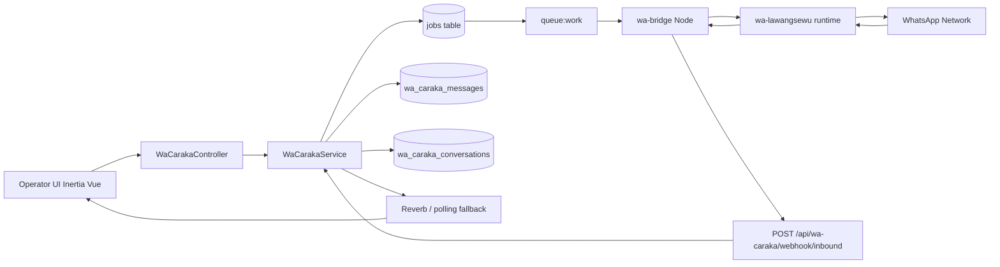

# Audit Khusus WA Caraka End-to-End

Tanggal: 19 April 2026  
Ruang lingkup: schema, Laravel module, bridge Node.js, runtime WhatsApp, webhook inbound, outbound queue, realtime UI, dan gap fitur

## 1. Ringkasan Eksekutif

WA Caraka adalah subsystem paling kompleks di Lawangsewu. Ia bukan sekadar fitur kirim pesan, tetapi sudah mencakup:

- inbox operator
- ownership percakapan
- handover antar operator
- outbound queue
- webhook inbound
- ticketing
- menu/session bot
- realtime update dan polling fallback

Dari hasil audit, fondasi WA Caraka sudah kuat dan sudah kembali berfungsi setelah hotfix outbound 19 April 2026. Namun ada beberapa area yang masih perlu dirapikan agar subsystem ini benar-benar stabil sebagai kanal operasional jangka panjang.

## 2. Komponen End-to-End

### 2.1. Lapisan Laravel

Komponen utama:

- `WaCarakaController`
- `WaCarakaWebhookController`
- `WaCarakaService`
- `WaCarakaConversationService`
- `SendWaCarakaOutboundMessage`
- event Reverb terkait conversation dan message sync

Peran:

- menerima aksi dari operator
- mengelola state percakapan di database
- menulis outbound ke queue
- menerima inbound dari webhook
- membroadcast update ke frontend jika realtime tersedia

### 2.2. Lapisan bridge Node.js

Lokasi aktif:

- `/home/dbprakom/wa-bridge`

Peran:

- menjadi adapter antara kontrak Laravel dan runtime WA aktif
- menerima permintaan kirim dari Laravel
- meneruskan inbound ke webhook Laravel

### 2.3. Lapisan runtime WhatsApp

Lokasi aktif:

- `/home/dbprakom/wa-lawangsewu`

Peran:

- session WhatsApp Web
- koneksi aktual ke WhatsApp network
- registrasi, QR, pengiriman, penerimaan pesan

### 2.4. Lapisan realtime

Komponen:

- Reverb `8080`
- polling fallback dari dashboard

Peran:

- menekan refresh manual untuk operator
- tetapi jika Reverb gagal, UI masih tetap bisa hidup lewat polling

## 3. Skema Database WA Caraka

Tabel yang terbukti ada di live database:

- `wa_caraka_conversations`
- `wa_caraka_messages`
- `wa_caraka_handovers`
- `wa_caraka_conversation_marks`
- `wa_caraka_logs`
- `wa_caraka_menus`
- `wa_caraka_sessions`
- `wa_caraka_tickets`
- `wa_session`

### 3.1. Tabel inti yang canonical saat ini

Paling mungkin menjadi pusat domain aktif:

- `wa_caraka_conversations`
- `wa_caraka_messages`
- `wa_caraka_handovers`
- `wa_caraka_tickets`

### 3.2. Tabel yang perlu audit ulang

- `wa_caraka_logs`
- `wa_session`

Karena:

- keduanya ada di live DB tetapi perannya tidak sejelas tabel domain utama di lapisan Laravel aktif

## 4. Alur End-to-End

## 5. Yang Sudah Oke

### 5.1. Domain model percakapan sudah benar

`wa_caraka_conversations` + `wa_caraka_messages` adalah kombinasi yang tepat untuk inbox operator modern.

### 5.2. Ownership dan handover sudah bagus

Ini fitur penting untuk call center atau operator desk, dan WA Caraka sudah memilikinya.

### 5.3. Outbound sudah dibungkus queue

Ini keputusan yang tepat. Pengiriman WhatsApp tidak ideal dilakukan sepenuhnya sinkron di request user.

### 5.4. Ada fallback polling

Ketika realtime tidak sehat, operator tidak sepenuhnya buta. Ini bagus untuk robustness.

### 5.5. Bridge dipisah dari Laravel

Secara arsitektur ini benar. Laravel tidak perlu menanggung lifecycle browser session WhatsApp.

## 6. Temuan Risiko dan Gap

### 6.1. Realtime belum sepenuhnya sehat

Fakta saat audit:

- Reverb aktif
- tetapi pernah menghasilkan 404 pada jalur broadcast

Dampak:

- operator lebih bergantung pada polling
- pengalaman realtime belum ideal

### 6.2. Kontrak runtime belum satu sumber kebenaran

Masalah:

- config Laravel menyebut bridge default `http://127.0.0.1:8790`
- runtime aktif ada di `/home/dbprakom`
- repo juga punya `wa-runtime/`

Dampak:

- source of truth integrasi WA masih rawan kabur

### 6.3. Media inbound belum tuntas

Masalah:

- gambar/sticker/video belum tersaji penuh sebagai preview end-to-end

Dampak:

- operator belum melihat pengalaman chat media yang lengkap

### 6.4. Tabel sesi ganda menandakan jejak evolusi

Masalah:

- `wa_caraka_sessions` dan `wa_session` hidup bersamaan

Dampak:

- rawan kebingungan jika insiden sesi perlu ditelusuri

### 6.5. Audit terhadap canonical log belum final

Masalah:

- `wa_caraka_logs` masih ada, sementara `wa_caraka_messages` juga menyimpan status dan metadata penting

Dampak:

- operator dan developer bisa membaca dua sumber histori berbeda

## 7. Apakah Sudah Sesuai dengan yang Seharusnya?

Jawabannya: cukup sesuai untuk kanal operasional aktif, tetapi belum sepenuhnya selesai sebagai subsystem yang final.

WA Caraka sekarang sudah lebih dari sekadar “bisa kirim WA”. Ia sudah berada pada level aplikasi operator. Itu berarti standar yang dibutuhkan juga lebih tinggi:

- kontrak runtime harus jelas
- tabel canonical harus jelas
- realtime harus sehat
- media harus lengkap
- runbook insiden harus jelas

## 8. Rekomendasi Praktis

### 8.1. Tetapkan canonical layer

Tegaskan secara tertulis:

- canonical message store = `wa_caraka_messages`
- canonical conversation store = `wa_caraka_conversations`
- status `wa_caraka_logs` dan `wa_session` harus diputuskan

### 8.2. Buat runbook WA Caraka tunggal

Isinya minimal:

- path runtime aktif
- path bridge aktif
- service name
- port
- webhook path resmi
- cara restart aman
- cara audit queue stuck

### 8.3. Selesaikan media pipeline

Ini langkah fungsional terbesar berikutnya setelah outbound pulih.

### 8.4. Stabilkan realtime

Reverb perlu dijadikan optional enhancement, bukan komponen yang membingungkan statusnya.

### 8.5. Tambahkan audit health check WA khusus

Minimal health sheet berkala:

- runtime alive
- bridge alive
- webhook reachable
- queue not stuck
- last inbound stored
- last outbound sent

## 9. Putusan Audit

WA Caraka saat ini sudah operasional dan cukup kuat, tetapi masih berada pada fase “kuat setelah hotfix”, belum pada fase “matang dan tenang”.

Kalau dianalogikan:

- mesinnya sudah hidup lagi
- kendaraan sudah bisa jalan
- tapi panel indikator, bagasi, dan buku servisnya masih perlu dirapikan
