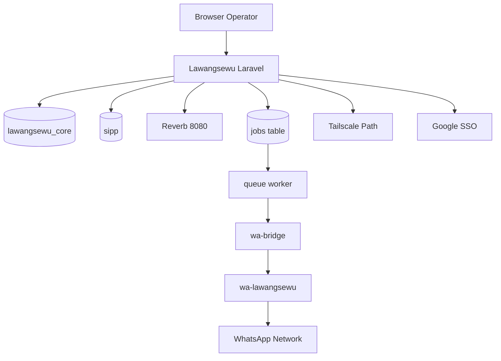

# Laporan Penjelasan Integrasi Eksternal Lawangsewu

Tanggal: 19 April 2026  
Tujuan: menjelaskan sistem-sistem luar yang terhubung ke Lawangsewu dengan bahasa sederhana dan analogi yang mudah dipelajari

## 1. Ringkasan Eksekutif

Lawangsewu tidak berdiri sendirian. Ia terhubung ke beberapa sistem luar agar bisa bekerja penuh. Tanpa integrasi ini, aplikasi tetap bisa hidup sebagian, tetapi tidak bisa menjalankan semua fungsi operasionalnya.

Integrasi eksternal utama yang terdeteksi saat audit:

- Google SSO
- database `sipp`
- Tailscale
- `wa-bridge`
- `wa-lawangsewu`
- Reverb

Sebagian berada di luar repo, sebagian berada di server yang sama tetapi merupakan proses terpisah.

## 2. Analogi Sederhana Keseluruhan

Bayangkan Lawangsewu adalah kantor pelayanan pusat.

- Laravel Lawangsewu = gedung kantor utamanya
- database utama = arsip utama kantor
- Google SSO = satpam yang memeriksa identitas tamu berdasarkan kartu resmi
- SIPP = kantor tetangga yang menyimpan berkas perkara
- Tailscale = jalan dinas privat menuju kantor-kantor internal
- `wa-bridge` = penerjemah yang menerima instruksi kantor dan meneruskannya ke petugas lapangan
- `wa-lawangsewu` = petugas lapangan yang benar-benar memegang handphone WhatsApp
- Reverb = interkom kantor agar staf cepat tahu ada kejadian baru
- queue worker = staf back office yang mengerjakan tugas antrean di belakang layar

Kalau salah satu integrasi ini rusak, kantor pusat belum tentu mati total, tetapi beberapa unit kerja akan tersendat.

## 3. Penjelasan per Integrasi

### 3.1. Google SSO

Fungsi nyata:

- memverifikasi login berbasis akun Google
- menyaring siapa yang boleh masuk melalui allowlist

Analogi:

- seperti satpam yang memeriksa kartu pegawai resmi dari instansi terpercaya

Kalau integrasi ini bermasalah:

- login SSO terganggu
- akses pengguna baru atau pengguna tertentu bisa tertahan

Status saat ini:

- fondasinya sudah ada dan cukup benar

### 3.2. Database `sipp`

Fungsi nyata:

- menjadi sumber data perkara, statistik, atau informasi persidangan tertentu
- dibaca langsung atau melalui cache `sipp_caches`

Analogi:

- seperti ruang arsip tetangga yang berisi berkas perkara, sementara Lawangsewu hanya meminjam atau menyalin ringkasannya bila perlu

Kalau integrasi ini bermasalah:

- statistik dan data perkara tidak segar
- dashboard perkara bisa kosong atau tertinggal

Status saat ini:

- boundary-nya sudah benar karena dipisah dari database utama `lawangsewu_core`

### 3.3. Tailscale

Fungsi nyata:

- membuka jalur privat ke subnet lokal kantor `192.168.88.0/24`
- dipakai untuk memantau dan mengakses server lokal internal

Analogi:

- seperti jalan tol dinas khusus pegawai yang menghubungkan kantor pusat dengan gedung-gedung internal tanpa harus lewat jalan umum yang lebih berisiko

Kalau integrasi ini bermasalah:

- dashboard Tailscale kehilangan visibilitas ke host lokal
- akses ke beberapa server lokal jadi terganggu

Status saat ini:

- implementasinya sudah baik dan pragmatis

### 3.4. `wa-bridge`

Lokasi aktif:

- `/home/dbprakom/wa-bridge`

Fungsi nyata:

- menerima instruksi dari Laravel untuk kirim pesan
- meneruskan pesan ke runtime WhatsApp
- mengirim inbound webhook kembali ke Laravel

Analogi:

- seperti petugas loket penerjemah: kantor pusat tidak langsung bicara ke lapangan, tetapi lewat petugas ini agar format dan instruksi tetap seragam

Kalau integrasi ini bermasalah:

- outbound WA macet
- inbound bisa tidak sampai ke Laravel
- webhook bisa 404 bila target salah

Status saat ini:

- aktif dan sangat penting
- perlu runbook yang lebih tegas karena ini bagian krusial

### 3.5. `wa-lawangsewu`

Lokasi aktif:

- `/home/dbprakom/wa-lawangsewu`

Fungsi nyata:

- menjadi runtime WhatsApp Web yang benar-benar terhubung ke jaringan WhatsApp
- mengelola QR, koneksi, pengiriman, dan penerimaan pesan

Analogi:

- ini seperti kurir lapangan yang benar-benar memegang ponsel dan berbicara ke dunia luar

Kalau integrasi ini bermasalah:

- WA Caraka lumpuh
- QR login bisa bermasalah
- pesan tidak terkirim atau tidak diterima

Status saat ini:

- aktif dan merupakan inti operasional WA Caraka

### 3.6. Reverb

Fungsi nyata:

- websocket internal untuk realtime event
- membantu dashboard chat dan WA Caraka lebih responsif

Analogi:

- seperti interkom kantor: kalau ada kejadian baru, staf lain bisa langsung tahu tanpa harus jalan ke ruang arsip setiap detik

Kalau integrasi ini bermasalah:

- fitur tidak selalu mati total, tetapi UI lebih bergantung pada polling
- pengalaman operator terasa kurang realtime

Status saat ini:

- aktif, tetapi jalur realtime pernah tercatat belum sepenuhnya sehat

### 3.7. Queue worker Laravel

Fungsi nyata:

- memproses tugas async dari tabel `jobs`
- sangat penting untuk outbound WA dan job lain yang tidak aman dikerjakan sinkron

Analogi:

- seperti staf belakang kantor yang mengerjakan berkas yang dititipkan ke baki antrean

Kalau integrasi ini bermasalah:

- job menumpuk di queue
- pesan outbound tampak “diam” walaupun request operator sukses dibuat

Status saat ini:

- fondasinya sudah benar

## 4. Peta Koneksi Sederhana

## 5. Mana yang Paling Kritis

Jika diurutkan dari dampak operasional langsung:

1. `lawangsewu_core`
2. queue worker
3. `wa-bridge`
4. `wa-lawangsewu`
5. Google SSO
6. `sipp`
7. Tailscale
8. Reverb

Penjelasan:

- database utama adalah jantung arsip
- queue worker dan dua komponen WA adalah rantai utama untuk WA Caraka
- Reverb penting, tetapi belum selalu bersifat blocking karena masih ada polling fallback

## 6. Apa yang Sudah Oke

- integrasi penting tidak dicampur semua ke monolith PHP
- WA runtime dipisah ke proses Node, ini benar
- SIPP diposisikan sebagai sumber luar yang dibuffer cache
- Tailscale dipakai untuk kebutuhan jaringan lokal dengan pendekatan yang lebih mudah dioperasikan

## 7. Apa yang Masih Perlu Diperbaiki

### 7.1. Source of truth integrasi WA

Masalah:

- repo dan server masih menyisakan potensi kebingungan soal runtime aktif

### 7.2. Runbook integrasi tunggal

Masalah:

- path, port, service name, dan endpoint belum terasa terkunci dalam satu dokumen resmi

### 7.3. Dokumentasi webhook

Masalah:

- pernah ada mismatch path antara dokumen dan route aktif

### 7.4. Realtime health

Masalah:

- Reverb aktif tetapi belum selalu bersih dari isu routing/broadcast

## 8. Kesimpulan Pembelajaran

Kalau ingin memahami Lawangsewu dengan cepat, ingat rumus ini:

- Laravel adalah kantor pusat
- database utama adalah arsip pusat
- queue worker adalah staf belakang kantor
- WA bridge adalah penerjemah loket
- WA runtime adalah kurir lapangan
- SIPP adalah kantor tetangga
- Tailscale adalah jalan privat
- Reverb adalah interkom

Dengan analogi itu, setiap kali ada masalah Anda bisa lebih mudah menebak titik gangguannya:

- kalau arsip bermasalah, cari database
- kalau pesan macet, cek queue worker -> bridge -> runtime
- kalau data perkara kosong, cek koneksi ke `sipp`
- kalau host lokal tidak terlihat, cek Tailscale
- kalau UI tidak realtime, cek Reverb

## 9. Putusan Akhir

Integrasi eksternal Lawangsewu secara umum sudah berada di jalur yang benar. Yang dibutuhkan sekarang bukan mengganti pola integrasinya, tetapi memperjelas kontraknya, menutup ambiguitas runtime aktif, dan merapikan runbook operasionalnya.
